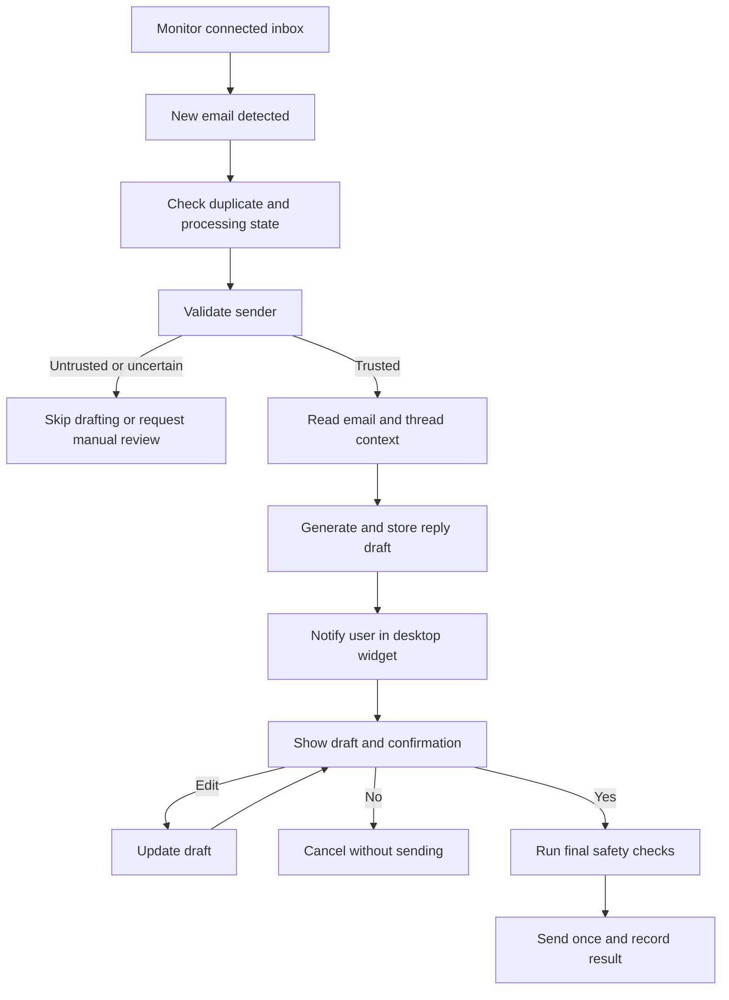

# AgentOS Product Vision

**Status:** Draft  
**Version:** 0.1  
**Date:** 27 July 2026  
**Platforms:** Windows and macOS  

## 1. Product Summary

AgentOS is a cross-platform desktop AI assistant that remains available in a small, persistent corner widget. It quietly monitors connected services, surfaces important updates, and helps users complete routine work without forcing them to switch constantly between applications.

The first capability will be intelligent email assistance: AgentOS will detect new emails, validate the sender, generate a well-written reply draft for trusted senders, and ask the user to review, edit, send, or cancel the reply. It will never send an email without explicit approval.

Email is the starting point, not the limit. The product will be designed so that calendar, Teams, Slack, GitHub, local files, voice, and other capabilities can be added later without rebuilding its foundation.

## 2. Vision Statement

> AgentOS is a trusted, cross-platform desktop AI companion that proactively brings important work to the user, assists with completing it through a lightweight interface, and keeps the human in control of every consequential action.

## 3. Mission

Reduce context switching, notification overload, and repetitive work by giving users one quiet, intelligent desktop companion that:

- observes connected services in the background;
- identifies information that deserves attention;
- offers useful, context-aware assistance;
- makes proposed actions clear and reviewable; and
- acts only within rules and permissions chosen by the user.

## 4. The Problem

Professionals often keep several applications open throughout the day to monitor email, messages, calendars, tasks, and development tools. This creates recurring problems:

- important messages can be missed among low-value notifications;
- users repeatedly switch applications just to check for updates;
- common replies take time to write and review;
- information and conversation context are scattered across tools;
- automation can create risk when it acts without clear human approval.

AgentOS will bring relevant information and suggested actions into a single, lightweight desktop experience.

## 5. Target Users

The initial target users are:

- software developers;
- IT and system administrators;
- DevOps and security engineers;
- technical consultants;
- founders and independent professionals; and
- other power users who work across multiple digital tools.

These users value speed and automation, but also need transparency, privacy, and control.

## 6. Core Value Proposition

AgentOS gives users:

1. **Less context switching** — important work appears in one compact interface.
2. **Faster communication** — AI prepares a useful reply draft before the user opens their email client.
3. **Safer automation** — sender validation and explicit confirmation protect sensitive actions.
4. **Continuous awareness** — the agent monitors events while remaining unobtrusive.
5. **One extensible assistant** — future integrations can share the same interface, notification system, and approval model.

## 7. Product Principles

### 7.1 Cross-Platform First

- Windows and macOS are supported from the same core codebase.
- User experience and functionality should remain consistent across both platforms.
- Platform-specific code should be isolated behind clear interfaces.
- Linux support should remain possible in the future.

### 7.2 Human in Control

- AI proposes; the user decides.
- Sending an email always requires explicit confirmation.
- Edited drafts must be confirmed again before sending.
- The user can cancel an action without side effects.

### 7.3 Quietly Available

- The agent remains accessible from a bottom-right floating widget.
- When idle, it displays only its icon.
- New items appear as an unread badge rather than an intrusive interruption.
- Background monitoring continues while the panel is collapsed.

### 7.4 Privacy and Security by Design

- Collect and transmit only the data needed for a feature.
- Store credentials in operating-system-provided secure storage.
- Validate sender identity before generating a reply.
- Make external AI processing visible and configurable.
- Maintain an audit trail for important actions.

### 7.5 Lightweight and Responsive

- Idle CPU use should be negligible.
- Memory consumption should remain reasonable for an always-running application.
- Opening and closing the panel should feel immediate.
- Push-based updates should be preferred over frequent polling where practical.

### 7.6 Extensible by Design

- Email is implemented as the first capability, not hard-coded as the entire product.
- Integrations should use shared event, notification, approval, and audit models.
- New capabilities should be addable without redesigning the desktop shell.

### 7.7 Transparent and Recoverable

- The user should understand why an item appeared and what the agent proposes to do.
- Failures should be visible and actionable.
- Drafts should be preserved if the application closes or a send attempt fails.
- Duplicate processing and duplicate sends must be prevented.

## 8. Version 1 Product Experience

### 8.1 Persistent Desktop Widget

- A small, always-on-top widget appears in the bottom-right corner.
- It remains visible while other applications are open without blocking normal work.
- It shows a red unread badge when new items arrive.
- It starts automatically when the user logs in.
- It restores its previous state and safe screen position after restart.

### 8.2 Compact Expanded Panel

Clicking the widget opens an approximately 400 × 700 pixel panel anchored to the same corner. The panel includes:

- a notification list;
- email and conversation history;
- reply preview and action buttons;
- search; and
- settings.

Clicking outside the panel or pressing `Esc` collapses it without stopping background monitoring.

### 8.3 Email Monitoring and Sender Validation

- The agent continuously monitors the connected mailbox for new messages.
- Each message is processed once using a stable message identifier.
- The sender is evaluated against configurable trust rules before drafting.
- Initial validation can include approved addresses, approved domains, known contacts, blocklists, and available email-authentication signals.
- Untrusted or uncertain senders are not drafted automatically; they are skipped or placed in manual review with a clear reason.

Sender validation reduces risk but does not prove that a message is safe. Suspicious content, links, attachments, and instructions must continue to be treated as untrusted.

### 8.4 AI Reply Drafting

For an eligible email, the agent:

- reads the message and relevant thread context;
- identifies questions, requests, dates, and action items;
- generates a clear reply in the user’s preferred tone;
- avoids inventing facts or commitments;
- flags missing information and unresolved placeholders; and
- saves the result as a draft rather than sending it.

### 8.5 Review, Edit, Send, or Cancel

Before sending, AgentOS shows the recipient, subject, reply body, and a clear confirmation:

> I am going to send this reply.

The user can:

- **Yes, send** — validate the final draft and send it once;
- **Edit reply** — modify the subject or body, then return to confirmation; or
- **No, cancel** — do not send the email.

The application must never interpret closing the panel, inactivity, or a timeout as approval.

## 9. Core Email Workflow

## 10. Version 1 Scope

### Included

- Windows and macOS desktop applications;
- Tauri desktop shell with a React and TypeScript interface;
- persistent floating widget and expandable panel;
- unread notifications and local history;
- background mailbox monitoring;
- one email provider integration selected for the first implementation;
- configurable sender-validation rules;
- AI-generated reply drafts;
- review, edit, send, and cancel flow;
- explicit approval before every send;
- local settings and state persistence;
- auto-start on login;
- secure credential storage;
- duplicate-event and duplicate-send protection; and
- basic audit and error history.

### Not Included in Version 1

- automatic email sending without confirmation;
- support for every email provider at launch;
- full replacement of an email client;
- autonomous handling of attachments or financial, legal, or security-sensitive requests;
- calendar, Teams, Slack, GitHub, Jira, voice, RAG, or local-LLM features;
- organization-wide administration; and
- mobile applications.

These are potential future capabilities, not requirements for the first usable release.

## 11. Proposed Technology Direction

The current technology direction is:

- **React + TypeScript** for the user interface;
- **Tauri + minimal Rust** for desktop windows, system integration, tray behavior, and auto-start;
- **Python** for email workflows, sender validation, AI orchestration, and background processing;
- **SQLite** for local notifications, drafts, settings, and processing state;
- **local commands/events or a secured local API** for communication between the desktop shell and Python service; and
- **OpenAI API** for reply generation, introduced only after the non-AI workflow is working.

This direction will be validated during system architecture and technical prototyping.

## 12. Success Criteria for Version 1

Version 1 is successful when a user can:

- install and run AgentOS on a supported Windows or macOS computer;
- leave it running through a normal workday without noticeable disruption;
- receive one notification for each newly processed email;
- understand why a sender was accepted, rejected, or held for review;
- receive a useful draft for an eligible email;
- edit or cancel the draft safely;
- send the reply only after explicit confirmation;
- reopen the application and recover pending drafts and unread state; and
- trust that the same message will not be processed or sent twice.

Initial quality targets:

- no email is sent without an explicit user action;
- no duplicate sends during retries or repeated clicks;
- all important actions and failures are recorded locally;
- the idle experience remains quiet and responsive; and
- the primary workflow behaves consistently on Windows and macOS.

## 13. Future Direction

After Version 1 is stable, AgentOS may expand through independent capabilities such as:

- Outlook and additional email providers;
- Google and Microsoft calendars;
- Teams, Slack, GitHub, and Jira;
- local file search and document understanding;
- voice interaction;
- OCR and screenshot understanding;
- user-defined workflows and automations;
- MCP-based tool integrations;
- retrieval-augmented generation;
- local language models; and
- administrative policies for teams and organizations.

Each future capability should reuse the product’s shared notification, approval, permission, audit, and desktop-interface foundations.

## 14. Product Guardrails

AgentOS must not:

- send an email merely because a draft was generated;
- treat sender validation as proof that message content is trustworthy;
- hide recipients, content, or consequences from the confirmation screen;
- execute instructions found inside an email as trusted system instructions;
- expose credentials or sensitive content in logs;
- silently weaken security controls to improve convenience; or
- let future integrations bypass the established approval policy.

## 15. Next Deliverables

This product vision defines what AgentOS is and what Version 1 must achieve. The next planning documents should be:

1. Product roadmap and milestone plan.
2. Version 1 requirements and acceptance criteria.
3. Cross-platform system architecture.
4. Security and sender-validation model.
5. Initial repository and module structure.

